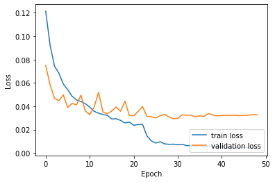

# digit-recognizer-for-pros

[Digit Recognizer](https://www.kaggle.com/c/digit-recognizer) is a `Kaggle` competition where using the dataset you have to create a `classifier` that can classify handwritten images into digits.

Here `no pre-trained CNN or predefined architecture` is used, this is a `custom` CNN architecture.

**While doing this we'll go through**

- Data augmentation using `ImageDataGenerator`
- Building `custom` CNN architecture
- Visualizing CNN (`filters` and `feature maps`)

## Table of contents

- [Getting started](#getting-started)
- [Kaggle Competition Results](#kaggle-competition-results)
- [Models performance and visualizations](#models-performance-and-visualizations)
  - [Visualizing Filters](#visualizing-filters)
  - [Visualizing Feature Maps](#visualizing-feature-maps)
- [License](#license)

## Getting started

The [notebook](https://www.kaggle.com/akashsdas/digit-recognizer-for-pros) is available on Kaggle to work in the same environment where this notebook was created i.e. use the same version packages used, etc...

If you are interested in the `model` the you can find that in the `Output` section of the [notebook](https://www.kaggle.com/akashsdas/digit-recognizer-for-pros).

## Kaggle Competition Results

**The best model has an accuracy of 99.5%**

## Models performance and visualizations

**Count plot for labels**

**The model is trained for 50epochs and below is the last epoch's results**

**Learning curves**

**Confidence matrix**

**Some predictions on the validation set**

### Visualizing filters

**Image of the 96th filter of the 1st conv layer**

**Images for only first 20 filters in the 1nd conv layer**

**Images for only first 10 filters in the 2nd conv layer**

### Visualizing feature maps

**We'll visualize feature maps for the digit 7**

**Feature maps by 1st conv layer**

**Feature maps by 2nd conv layer**

## License

[APACHE LICENSE, VERSION 2.0](./LICENSE)
